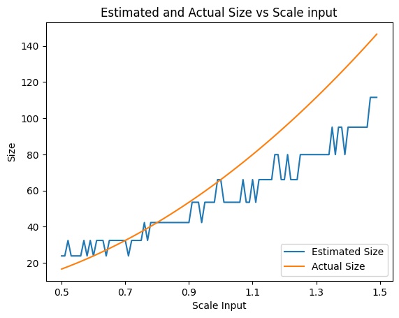
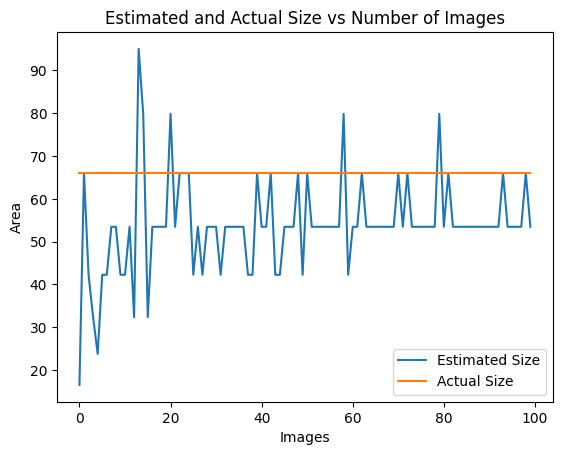

## Stochastic Fish Size Estimation Computer Vision Algorithm

### Introduction
Measuring size of object is a challenging task in computer vision. Typical methods include obtaining depth data or using reference object. Specifically, thaere have been machine learning models developed for fish size recgonition based on bio-features of fishes [1].  
In this repository, I showcase an alternative method - stoichastic estimation, for fish size estimation with camera measurement. Which require no depth estimation and reference object, all you need is just a camera.


----

### Quick Start
Creating environment with anaconda (I used python3.10):

```
conda env create -f environment.yml
conda activate fish_cv
python visualization.py
python simulation.py
```
  
If you see something like the following in the projected visualization, its probably due to a fish being too close the camera in camera axis, but . You can rerun `visualization.py` for a better view.


### Problem Modelling & Assumptions

Imageine you are given a fish recgonition computer vision model, which can effectively identify geomatery of fishes for a given image, as shown in figure below. How could we then estimate size of fishes in a fish farm? 


Let's simplify the problem a little bit. Assuming the following:  

Chosen assumptions:
- A 3mx3mx3m fish tank
- 100 fishes in the tank
- camera modelled with projective camera model

Necessary assumptions:
- Near plane and far plane of the camera can be estimated and are constant
- Location of fishes are uniformly distribted in the tank at a randomly selected time
- Size of fishes follows normal distribution, our goal is to estimate the mean of the distribution
- Fishes rotates randomly

Typically, number of fish and geomatery of fish tank are know in farming conditions. and near and far plane could either be boundaries of the tank or blurring of water.  


We then have the folowing 3d model (the four lines represents fov of the camera):


The projection onto the camera will be:


### The algorithm

Now I introduce the algorithm, which is simply the answer to the following question:  

__Can we recover the mean fish size using many measurement of fish size in image?__


Which I believe is possible with the given assumptions.  

First, consider distribution of depth in camera frame given the that the fish is seen. In fact, the probability of fish at a certain depth is the volume of the small (red) frustum divided by the bigger (blue) frustum:


Volume of frustum is given by the following formula:
$$ V = (S1 + S2 + (S1\cdot{}S2)^\frac{1}{2})*(\frac{h}{3})$$

Where S1 and S2 are area of the two bases of the frustum, and h is height of the frustum.

What about rotation of the fishes? Let's think deeper about rotation of fishes. If we have a camera viewing a fish as shown in following figure, actually only angle $\theta$ affect the measured size.


Which we can simplify the estimation signfiicantly. I chose to numerically compute the expected size of fish at a depth rotated, as it raises some complicated arithmetics.

To summarise:
1. Estimate near plane and far plane of the camera
2. Calculate the probability distribution of fish at different of depth
3. At each depth, compute projected size of the fish in image, rotated from 0 to $2\pi$, average them.
4. For each angle averaged size at each depth, multiply it by the probability calculated in step 2.
5. Repeat step 2 to 4 with different chosen fish size, record the expected projected size.
6. By taking many image measurement, calculate the average projected fish length. 
7. Lookup the expected sizes given in step 5, find its corrsponding chosen fish size, this is our estimation.


### Discussion
#### Performance
We compare estimated size with actual size, with different scaling input. In general, length is better estimated compare to size. It is also observed that both length and area are underestimated. 





Considering estimation vs number of images, one could see that the estimation converges quickly.





Heres why there is a bias (under estimation) in our estimation - because I only include fishes that are entirely within the frame. Fishes that are closer to the camera are less likely to be included, while further to the camera, fishes are little less like to be included only. This leading to an underestimation of fish sizes, in particular, this issue in our simulation raises as fish actual size increases.

<!-- 
#### Numerical vs Analytical
Lets also see why I chose to numerically figure expected size of a fish when rotated randomly at a certain depth. Consider the followign 2d case: -->


### Future work

- Taking things one step further, we can consider occolution. As we know the number of fish and volume of the tank, probability of a fish being blocked is given by:
$$P(blocked) = \rho{}_f \cdot{} V $$

Where $\rho{}$ is number of fish divided by tank volume. V is the volume formed between near plane and the fish.


- As you can see in the demo gif, fish at extreme angle couldn't be measured. This can be included into the simulation by dropping extreme angles when caculating the expected fish size from rotation.

- The current method provides an approximatoin of the fish size, while future work can extend size predictions to more objects


### References 

[1] i-enter coporation, Fish Size Estimation Camera, https://www.i-enter.co.jp/en/marine-tech/fishsize-measurement/
